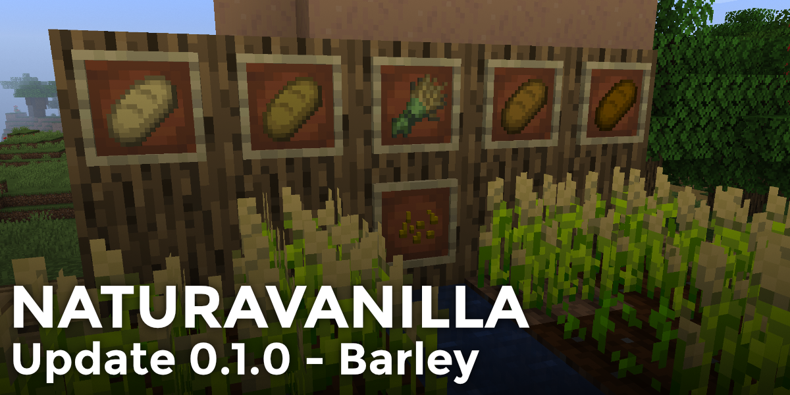

# NaturaVanilla - 0.1.0
> This mod is still under Development. While it *should* work, it has not been tested a lot and doesn't feature lots of content at the moment. Besides that, your saves might break between versions.

NaturaVanilla is a Mod that attempts to add various features which would fit into the vanilla game.

## What does the mod currently add?
- New Crop Type: Barley
    - Barley Bread
- Crafting Bread now gives you the raw form, put it in a Furnace to get more saturation from it

## What Languages is this Mod currently available in?
- American English (100%)

## Dependencies
- Fabric API [[Modrinth]](https://modrinth.com/mod/fabric-api) [[CurseForge]](https://www.curseforge.com/minecraft/mc-mods/fabric-api)